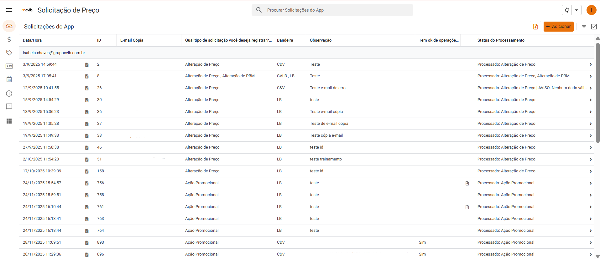

# App de Solicitação de Preços

Automação de solicitações de preços com foco em **padronização operacional**, **eficiência no fluxo comercial** e **integração entre AppSheet, Google Sheets, Google Drive e Google Apps Script**.

---

## Visão Geral

Este projeto foi desenvolvido para resolver um processo operacional altamente manual na gestão de solicitações de preço. Antes da automação, as demandas eram recebidas por e-mail, em alto volume, com baixa padronização e necessidade de tratamento manual em planilhas e arquivos anexos.

A solução transformou esse fluxo em um processo estruturado, rastreável e escalável, com entrada padronizada via aplicativo, processamento automatizado dos dados e envio de comunicações automáticas aos solicitantes.

Mais do que uma automação pontual, este projeto foi desenhado como um **produto interno** para suportar a rotina da área comercial e de pricing, reduzindo esforço operacional e aumentando a confiabilidade do processo.

---

## Problema de Negócio

O fluxo anterior apresentava limitações relevantes:

- solicitações enviadas por e-mail, sem padronização de preenchimento
- necessidade de abrir anexos manualmente e consolidar dados em planilhas
- risco elevado de erro operacional
- baixa rastreabilidade do status das solicitações
- dificuldade para escalar o processo com aumento de volume
- retorno ao solicitante feito de forma manual e descentralizada

Na prática, isso gerava retrabalho, lentidão e pouca visibilidade sobre o andamento das demandas.

---

## Objetivo do Produto

Construir uma solução capaz de:

- padronizar o envio das solicitações de preço
- automatizar a leitura e o processamento dos arquivos recebidos
- consolidar dados em bases estruturadas por tipo de solicitação
- registrar status e logs de execução
- notificar automaticamente os solicitantes sobre erros, avisos e evolução do processo
- reduzir dependência de atividades manuais repetitivas

---

## Solução Proposta

A solução foi estruturada em duas frentes complementares:

### 1. Intake e processamento operacional
Um aplicativo no AppSheet centraliza as solicitações e recebe os arquivos padrão preenchidos pelos usuários. Um script em Google Apps Script identifica solicitações pendentes, lê os dados enviados, converte arquivos quando necessário, filtra informações relevantes e grava os registros nas abas de destino corretas.

### 2. Comunicação automatizada de status
Outro fluxo lê as abas operacionais já tratadas, identifica registros com status elegível para comunicação e envia e-mails automáticos ao solicitante, com agrupamento por solicitação e detalhamento dos itens processados.

O resultado é um fluxo ponta a ponta que conecta **entrada padronizada**, **tratamento automatizado**, **registro operacional** e **comunicação ao usuário**.

---

## Arquitetura da Solução

```text
Usuário / Área Comercial
        ↓
AppSheet / Formulário de Solicitação
        ↓
Google Sheets (aba de origem)
        ↓
Google Apps Script
  - leitura de pendências
  - validação de campos
  - leitura de anexos no Drive
  - conversão de arquivo para Google Sheets
  - filtragem por tipo e bandeira
  - consolidação em abas de destino
  - gravação de logs
        ↓
Google Sheets (abas operacionais)
        ↓
Google Apps Script
  - leitura de status
  - agrupamento de registros
  - envio de e-mails automáticos
        ↓
Solicitante recebe atualização


### Entrada das Solicitações

Interface utilizada pela área comercial para registro das demandas de pricing.
As solicitações são padronizadas e armazenadas em base estruturada para processamento automatizado.


